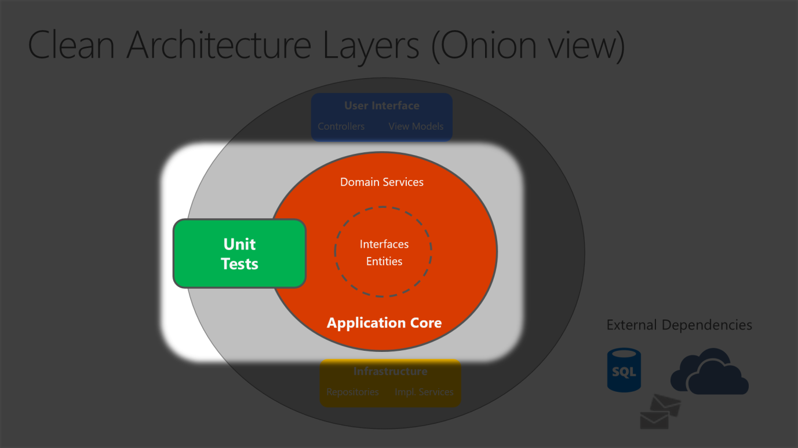
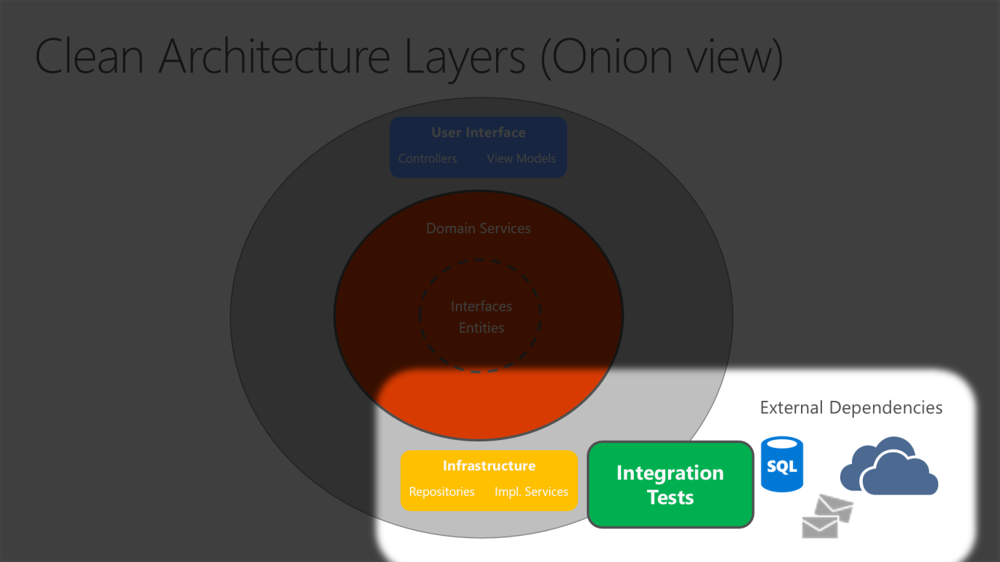

# **Architettura applicazione .NET**

La  maggior parte delle applicazioni .NET vengono sviluppate e distribuite come singoli eseguibili oppure singole applicazione web (monolitiche), tuttavia questo approccio non risulta essere ottimale nella maggior parte delle applicazione business più complesse.  
Un'applicazione monolitica è un'applicazione autonoma, che a runtime può interagire con altri servizi o data stores, viene distribuita singolarmente ma se deve essere scalata orizzontalmente occorre duplicare l'instanza dell'applicaizone su più server/vm.
 

Quando si opta per un'applicazione sviluppata all'interno dello stesso progetto, il concetto di separazione viene espresso mediante l'uso delle cartelle. 
Ad esempio, se prendiamo il modello MVC andremo a creare le rispettive cartelle Views, Models, Controllers, Data e Services. In questo approccio la parte di "presentation" viene definita nella cartella Views, l'implementazione dell'accesso ai dati viene definita nella cartella Data mentre la parte di "Business Logic" viene definita nella cartella "Services" e "Models". 

Con l'aumento delle dimensione e della complessità del progetto, anche il numero di file e cartelle aumenta, ed iniziamo ad avere i primi problemi. 
L'interfaccia utente, essendo divisa in più parti (Models, Views, Controllers), non può essere raggruppata ed ordinata alfabeticamente, tale problema si accentua quando andiamo ad inserire nuovi costrutti come ad esempio "Filters" oppure "ModelBinders". 
La logica di business è divisa tra "Models" e "Services" e ciò non rende chiara la dipendenza tra classi e servizi. 

Un modo per gestire i problemi elencati precedentemente dovuti all'aumentare della complessità del progetto è quello di far evolvere queste applicazioni in soluzioni multiprogetto, dove ogni progetto rappresenta un "Layer" applicativo.
Tale approccio segue il principio di "singola responsabilità" ed, oltre all'organizzazione del codice, offre una serie di vantaggi.
- Le funzionalità comuni possono essere riutilizzate in tutta l'applicazione;
- Si possono imporre delle restrizioni su quali layer possoo comunicare con altri layer, favorendo l'incapsulamento;
- Semplificare il processo di sostituzione dell'implementazioni di una funzionalità all'interno dell'applicazione;
- Sostituzione delle implementazione delle funzionalità a scopo di test;

# Clean Architecture

Le applicazioni che seguono il principio della inversione delle dipendenze (Dependency Injection) e i principi del DDD (Domain-Driven Design) tendonodo ad utilizzare un'architettura simile che, nel corso degli anni, è stata nominata in diversi modi quali "Hexagonal Architecture" e "Ports-and-Adapters". Recentemente è stata definita come "Onio Architecture" oppure "Clean Architecture". 
Tale architettura mette al centro dell'applicazione la Business Logic ed il modello dell'applicazione, invertendo la dipendeza.  
Questa funzionalità si ottiene definendo delle interfacce nell'Application Core che vengono poi implementate nel layer dell'Infrastructure.

In questo diagramma le dipendenze si propagano dal cerchio più esterno verso quello più interno. 
All'interno del progetto "Application Core" non ci sono dipendenze con altri layer dell'applicazione mentre ritroviamo le entità e le interfacce (che possono essere racchiuse in un progetto ad-hoc chiamato DOMAIN) ed i "Domain Services" ovvero dei servizi che implementano le interfacce definite nel progetto stesso che non necessitano di dipendenze esterne. 
Al di fuori dell' "Application Core" troviamo il layer "Infrastructure" che conterrà le implementazione delle interfacce che necessitano di servizi esterni ed il layer "User Interface" che contiene l'interfaccia utente.  

Le frecce continue rappresentano le dipendenze in fase di compilazione mentre le freccie trattegiate rappresentano le dipendenze solo a runtime.  
Da questo diagramma possiamo notare che il layer di "User Interface", in fase di compilazione, utilizza le interfacce definite nell' "ApplicationCore" e idealmente non deve conoscere l'implementazione presente nel layer "Infrastrcture" mentre, in fase di esecuzione, le implementazioni devono essere presenti e questo lo si ottiene tramite la "dependency injection".  
Di seguito la visualizzazione dettagliata di un'applicazione ASP.NET Core che utilizza la "Clean Architecture".

Dato che il layer "application core" non dipende dal layer "infrastructure", il processo di scrittura degli "unit tests" è semplificato. Di seguito viene mostrato come vengono inseriti i tests in quest'architettura.

----------

# 1. Struttura del progetto

In una soluzione che segue i principi della "Clean Architecture", ogni progetto ha le proprie responsabilità pertanto alcuni "tipi" appartengono ad un determinato progetto (layer).  

## 1.1 Application Core
In questo progetto viene rapresentato il modello di business, che include Entità, Servizi ed Interfacce. 
Nelle interfacce troveremo anche le astrazioni dei servizi per le operazioni che verranno poi eseguite sfruttando la relativa implementazione presente nell progetto "Infrastructure".

- Entities (business model classes that are persisted)
- Aggregates (groups of entities)
- Interfaces
- Domain Services
- Specifications
- Custom Exceptions and Guard Clauses
- Domain Events and Handlers

## 1.2 Infrastructure
In questo progetto in genere troviamo le implementazione per l'accesso ai dati (ad es. EF), le implementazioni dei servizi definiti tramite le interfacce presenti nel progetto "Application Core"

- EF Core types (DbContext, Migration)
- Data access implementation types (Repositories)
- Infrastructure-specific services (for example, FileLogger or SmtpNotifier)

## 1.3 User Interfaces (UI)
In questo progetto troviamo l'implementazione dell'interfaccia utente, nel caso di un'applicazione ASP.NET Core MVC troveremo tutti i controllers e le views e fa riferimento al "Application Core".

- Controllers
- Custom Filters
- Custom Middleware
- Views
- ViewModels
- Startup

La classe Startup oppure il file Program.cs deve essere responsabile della condigurazione e registrazione delle dipendenze necessarie al funzionamento della soluzione.
 

In alcuni scenari può essere utile estrapolare dall'Application Core la parte inerente alle Entità, agli Eventi ed i DTO, in questo caso viene creato un'ulteriore progetto chiamato "Domain" che gestirà Entità ed Eventi mentre i DTO verranno inseriti in un nuovo progetto chiamato "Shared" poichè, nel caso di applicazione Client-Server, sarà possibile riutilizzarli (vedi Blazor WASM).

----------

## 2. Template
All'interno del repo è presente il pacchetto zip CleanArchitecture.zip, scaricarlo e copiarlo nella seguente directory: ***C:\Users\<utente>\Documents\Visual Studio 2022\Templates***. 
Una volta copiato, in fase di creazione nuovo progetto, tra i modelli presenti si potrà scegliere "Clean Architecture". Successivamente potrà essere aggiunto il layer di "User Interface" nella tecnologia desiderata (WPF, WinForm, ASP.NET Core, Console Application).

Fonti:
- https://learn.microsoft.com/en-us/dotnet/architecture/modern-web-apps-azure/common-web-application-architectures